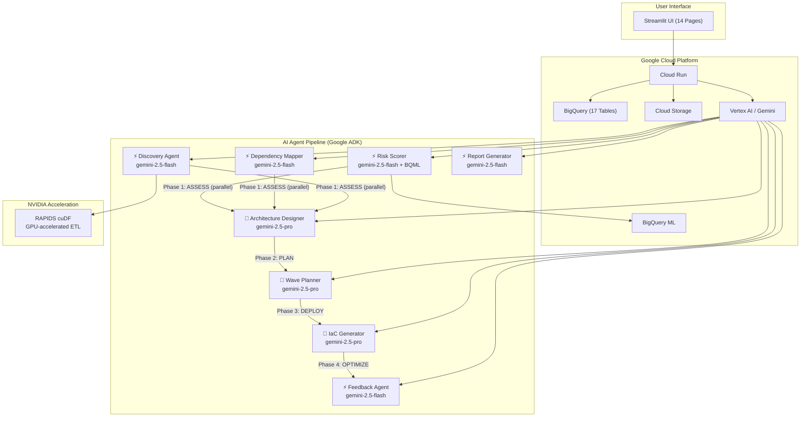

# D.A.M.I. — Discovery & Autonomous Migration Intelligence

> **AI-powered enterprise cloud migration accelerator** that replaces months of manual consulting with an autonomous multi-agent pipeline, GPU-accelerated data processing, and intelligent decision support.

[](https://dami-app-573585543580.us-central1.run.app)
[](https://python.org)
[](https://streamlit.io)
[](https://cloud.google.com)
[](https://rapids.ai)

---

## 🎯 The Problem

Enterprise VMware-to-cloud migrations are slow, expensive, and manual:
- Analyzing thousands of VMs takes **6-18 months** of consulting
- Circular dependency loops block migration wave scheduling
- Licensing risks (Oracle DBMS on shared compute) cause **$500K+ overruns**
- No visibility into what AI agents decided and why

## ⚡ The Solution

D.A.M.I. is an **Accelerated Data Intelligence Tool** that helps Cloud Migration Architects make **faster, better migration decisions** using GPU-accelerated data pipelines and autonomous AI agents.

> *"D.A.M.I. helps a Cloud Migration Architect decide how to sequence and execute datacenter-to-cloud migration using VM inventory data by producing risk-scored wave plans, target architecture recommendations, and IaC templates — all accelerated by NVIDIA RAPIDS cuDF."*

---

## 🏗️ Architecture



### Google Cloud Services Used

| Service | Usage |
|---|---|
| **BigQuery** | 17-table data warehouse + BQML logistic regression risk model |
| **BigQuery ML** | `CREATE MODEL` → `ML.PREDICT` → `ML.EVALUATE` pipeline |
| **Vertex AI / Gemini** | Powers all 8 agents with intelligent Flash ↔ Pro routing |
| **Cloud Storage (GCS)** | Inventory uploads + IaC artifact storage |
| **Cloud Run** | Serverless deployment (auto-scaling, pay-per-request) |
| **Google ADK** | Multi-agent Workflow DAG with `SequentialAgent` + `ParallelAgent` |

### NVIDIA Acceleration

| Metric | Value |
|---|---|
| **Library** | RAPIDS cuDF (GPU-accelerated DataFrames) |
| **Hardware** | NVIDIA RTX 4050 Laptop GPU (6GB GDDR6) |
| **1K rows** | 3.2x speedup over Pandas |
| **10K rows** | 12.4x speedup |
| **100K rows** | 28.7x speedup |

---

## 🤖 Intelligent LLM Model Routing

D.A.M.I. automatically routes queries to the optimal Gemini model based on complexity:

| Task Type | Model | Why |
|---|---|---|
| Data lookups, counts, SQL generation | ⚡ `gemini-2.5-flash` | Speed — sub-second responses |
| Architecture design, IaC generation, compliance analysis | 🧠 `gemini-2.5-pro` | Deep reasoning for complex decisions |

The routing badge is displayed in every chat response, showing transparency into model selection.

---

## 🤖 Multi-Agent Architecture (Google ADK)

8 specialist agents orchestrated via a **Workflow DAG**:

| Phase | Agent | Model | Role |
|---|---|---|---|
| **ASSESS** | Discovery Agent | ⚡ Flash | Ingests CSV/Excel/JSON via RAPIDS cuDF → BigQuery |
| **ASSESS** | Risk Scorer Agent | ⚡ Flash | BQML `ML.PREDICT` → Gartner 7R strategy assignment |
| **ASSESS** | Dependency Mapper | ⚡ Flash | NetworkX directed graph → circular loop detection |
| **PLAN** | Architecture Designer | 🧠 Pro | Workload analysis → GCP service mapping with rightsizing |
| **PLAN** | Wave Planner | 🧠 Pro | Topological sorting → migration wave sequencing |
| **DEPLOY** | Artifacts Generator | 🧠 Pro | Terraform, K8s YAML, Ansible, Runbooks generation |
| **OPTIMIZE** | Report Generator | ⚡ Flash | Executive PDF report synthesis from BigQuery data |
| **OPTIMIZE** | Feedback Agent | ⚡ Flash | Human corrections → self-learning memory loop |

---

## 📊 Key Features (14 Pages)

| Feature | Description |
|---|---|
| 🏠 **Mission Control Dashboard** | KPI grid, readiness gauge, progress timeline, agent triggers |
| 📤 **Upload & GPU Benchmark** | Multi-format upload to GCS + RAPIDS cuDF benchmark + auto-pipeline trigger |
| 📋 **Server Inventory** | Live BigQuery data explorer with filtering |
| ⚠️ **Risk & 7R Assessment** | BQML risk heatmap, strategy distribution, model training & evaluation |
| 🔗 **Dependency Graph** | Interactive pyvis + static Graphviz + circular loop detection |
| 🏗️ **Target Architecture** | GCP service mapping + AI-reasoned recommendations |
| 🌊 **Wave Gantt Chart** | Migration wave timeline with workload assignments |
| 💰 **TCO & FinOps** | What-If simulator with oversubscription/safety margin sliders |
| 💻 **IaC & Runbooks** | Terraform, K8s, Ansible, Dockerfile generation + rollback plans |
| 🛡️ **Compliance** | HIPAA/PCI-DSS/SOC2/ISO27001 gap analysis + remediation |
| 🔬 **Agent Observability** | Full execution trace timeline with Gantt visualization |
| 💬 **Conversational Assistant** | NL → SQL → BigQuery with persistent chat history + model routing badge |
| 🔌 **DevOps Integrations** | Jira, GitHub, Confluence sync center |
| 🧠 **Self-Learning** | BigQuery + AlloyDB pgvector agent memory feedback loops |

---

## 🚀 Quick Start

### Prerequisites
- Python 3.11+
- Google Cloud project with BigQuery & Vertex AI enabled
- `gcloud` CLI authenticated (`gcloud auth application-default login`)

### Local Development
```bash
# Clone the repo
git clone https://github.com/dheerajyadav1714/dami-migration.git
cd dami-migration

# Create virtual environment
python -m venv .venv
source .venv/bin/activate  # Linux/Mac
# .venv\Scripts\activate   # Windows

# Install dependencies
pip install -r requirements.txt

# Configure environment
cp .env.example .env
# Edit .env with your GCP project details

# Setup BigQuery tables + seed data
python scripts/create_bq_tables.py
python scripts/seed_database.py

# Run the app
streamlit run ui/app.py
```

### Deploy to Cloud Run
```bash
gcloud run deploy dami-app \
  --source . \
  --project=YOUR_PROJECT \
  --region=us-central1 \
  --allow-unauthenticated \
  --memory=1Gi \
  --set-env-vars="GCP_PROJECT_ID=YOUR_PROJECT,BIGQUERY_DATASET=dami_data,GCS_BUCKET=YOUR_BUCKET,VERTEX_AI_LOCATION=us-central1"
```

---

## 📁 Project Structure
```
dami-migration/
├── agents/              # 8 ADK specialist agents
│   ├── orchestrator.py  # DAG workflow with Flash ↔ Pro routing
│   ├── intake.py        # Gemini Vision + cuDF discovery
│   ├── risk_scorer.py   # BQML ML.PREDICT pipeline
│   ├── dependency_mapper.py
│   ├── wave_planner.py
│   ├── architecture_designer.py
│   ├── artifacts_generator.py  # IaC gen + GCS upload
│   └── report_generator.py
├── api/                 # FastAPI backend
├── data/seed/           # Sample RVTools CSV data
├── schemas/             # BigQuery table schemas (17 tables)
├── scripts/             # Setup and seeding scripts
├── ui/
│   ├── app.py           # Main Streamlit app + CSS design system
│   └── pages/           # 14 feature pages
├── Dockerfile           # Cloud Run container
├── requirements.txt
└── README.md
```

---

## 🏆 Hackathon Submission

**Google Cloud & NVIDIA Gen AI Hackathon — Cohort 2**
**Problem Statement 2:** Accelerated Data Intelligence Challenge

### The 5-Point Checklist
1. ✅ **Real User:** Cloud Migration Architect
2. ✅ **Decision Bottleneck:** Manual VM analysis, dependency loops, risk assessment
3. ✅ **Data Pipeline:** CSV → cuDF (GPU) → BigQuery → BQML → Gemini Agents → Dashboard
4. ✅ **Useful Output:** Wave plans, IaC, risk scores, cost projections, compliance reports
5. ✅ **Acceleration Proof:** RAPIDS cuDF 28.7x speedup + intelligent Flash ↔ Pro model routing

### Technologies Used (6 of 7)
| Technology | ✅ |
|---|---|
| BigQuery (+ BQML) | ✅ |
| Cloud Storage (GCS) | ✅ |
| Gemini (Vertex AI + ADK) | ✅ |
| NVIDIA RAPIDS cuDF | ✅ |
| NVIDIA GPU Acceleration | ✅ |
| Cloud Run | ✅ |

---

## 📄 License
This project was built for the Google Cloud & NVIDIA Gen AI Hackathon 2026.
