# D.A.M.I. (Discovery & Autonomous Migration Intelligence)
## End-to-End System Architecture & Execution Flow Guide

This document explains the end-to-end architecture, data flows, agent hierarchy, and user interface layers of the **D.A.M.I.** enterprise migration assistant.

---

## 1. High-Level Architecture Overview

D.A.M.I. is designed as a modular, containerized multi-agent system built on Google Cloud Platform, using:
- **Streamlit** for the rich, interactive 14-page dashboard.
- **FastAPI** for the backend API endpoints.
- **Google ADK (Agent Development Kit)** to orchestrate the specialist agents.
- **Google GenAI SDK (Gemini 2.5 Flash)** for reasoning, SQL generation, and infrastructure artifact creation.
- **Google BigQuery** as the centralized data warehouse storing raw inventory, dependencies, mappings, execution traces, and agent memory.
- **AlloyDB (Postgres + pgvector-ready)** as the semantic similarity storage engine for the Self-Learning Memory loop.
- **NVIDIA RAPIDS (cuDF)** for GPU-accelerated ingestion and profiling of large inventory datasets.

### System Diagram

```mermaid
graph TD
    %% Frontend and Client Layer
    subgraph Client Layer [Frontend & APIs]
        UI[Streamlit Dashboard - 14 Pages]
        API[FastAPI Backend - Port 8000]
        ADK_Web[ADK Web Playground - Port 8080]
    end

    %% Agent Coordination Layer
    subgraph Agent Layer [Google ADK Agent Hierarchy]
        Orchestrator[Root Orchestrator - orchestrator_agent]
        
        subgraph Phase 1: ASSESS [Parallel Execution]
            Discovery[Discovery Agent]
            DepMapper[Dependency Mapper]
            RiskScorer[Risk Scorer]
        end
        
        subgraph Phase 2: PLAN [Sequential Execution]
            ArchDesigner[Architecture Designer]
            WavePlanner[Wave Planner]
        end
        
        subgraph Phase 3: DEPLOY
            DeployAgent[IaC & Runbook Deploy Agent]
        end
        
        subgraph Phase 4: OPTIMIZE
            FeedbackProc[Feedback Processor]
        end
        
        Orchestrator --> |Delegates| Phase_1
        Orchestrator --> |Delegates| Phase_2
        Orchestrator --> |Delegates| Phase_3
        Orchestrator --> |Delegates| Phase_4
    end

    %% Data and Memory Layer
    subgraph Database Layer [GCP & Memory Backend]
        BQ[(BigQuery Warehouse - 17 Tables)]
        AlloyDB[(AlloyDB pgvector-ready)]
        LocalFiles[(Workspace Assets - generated_assets/)]
    end

    %% Connections
    UI --> |REST / Functions| API
    API --> Orchestrator
    
    Discovery --> |Ingests & Profiles| BQ
    Discovery --> |NVIDIA RAPIDS cuDF| BQ
    DepMapper --> |NetworkX Graphs| BQ
    RiskScorer --> |BQML & Heuristics| BQ
    ArchDesigner --> |Rightsizing Mapping| BQ
    WavePlanner --> |Topological Sorting| BQ
    DeployAgent --> |Gemini Structured HCL/YAML| BQ
    DeployAgent --> |Writes Local Files| LocalFiles
    FeedbackProc --> |Saves corrections| BQ
    FeedbackProc --> |Syncs memories| AlloyDB
    
    Orchestrator --> |Retrieves memories| BQ
    Orchestrator --> |Semantic context| AlloyDB
```



---

## 2. 8 Specialist Agents & Workflow DAG

D.A.M.I. uses a structured **Workflow Directed Acyclic Graph (DAG)** to orchestrate specialist agents. 

### The Workflow DAG (9 Edges)
1. **START** $\rightarrow$ **Discovery Agent**
2. **START** $\rightarrow$ **Dependency Mapper**
3. **START** $\rightarrow$ **Risk Scorer** *(Discovery, Dependency Mapper, and Risk Scorer run in parallel during ASSESS)*
4. **Discovery Agent** $\rightarrow$ **Architecture Designer**
5. **Dependency Mapper** $\rightarrow$ **Architecture Designer**
6. **Risk Scorer** $\rightarrow$ **Architecture Designer** *(Architecture Designer aggregates assessments to design mappings)*
7. **Architecture Designer** $\rightarrow$ **Wave Planner** *(Wave Planner schedules sequence based on mappings & graph topology)*
8. **Wave Planner** $\rightarrow$ **Deploy Agent** *(Deploy Agent generates HCL, YAML, and playbooks)*
9. **Deploy Agent** $\rightarrow$ **Feedback Processor** *(Feedback Processor updates configurations based on human corrections)*

---

### Agent Index

#### 1. Discovery Agent (`agents/discovery.py`)
- **Role**: Ingests, normalizes, and sanitizes infrastructure records.
- **Input**: Raw inventory files (RVTools CSV, AWS JSON, Azure exports).
- **Core Action**: Detects and normalizes machine configurations (CPU, RAM, Disk, OS names) and saves them into the `servers` table in BigQuery.
- **Hardware Acceleration**: Integrates **NVIDIA RAPIDS (cuDF)** to speed up parsing, profiling, and group aggregations. If a GPU workspace is available, it executes natively via cuDF; otherwise, it projects GPU times using documented NVIDIA acceleration factors.

#### 2. Dependency Mapper (`agents/dependency_mapper.py`)
- **Role**: Models application networks and identifies migration hazards.
- **Input**: `network_flows` and `app_dependencies` tables.
- **Core Action**: Constructs a **NetworkX directed graph (`DiGraph`)** of all virtual machines and applications. Runs `nx.simple_cycles()` to detect circular dependency loops (highlighted in red on the UI) that must be migrated together, identifies shared network services (high in-degree), and maps orphan services (zero active connections).

#### 3. Risk Scorer (`agents/risk_scorer.py`)
- **Role**: Grades workloads and recommends Gartner 7R migration pathways.
- **Input**: `servers` inventory data.
- **Core Action**: Determines risk scores (0.0 to 10.0) based on CPU/RAM headroom, EOL Operating Systems (e.g., Windows 2008 or RHEL 7), dependency complexity, and compliance requirements. When a **BQML Logistic Regression model** (`migration_risk_model`) is trained, the agent runs `ML.PREDICT` to classify servers as requiring complex strategies (Refactor/Replatform/Relocate = 1) vs simple strategies (Rehost/Retire = 0), and blends the ML prediction with heuristic scoring. Recommends Gartner 7R strategies:
  - *Retire*: Powered off or inactive servers (>90 days).
  - *Retain*: Non-production HIPAA servers.
  - *Relocate*: Oracle databases on-prem (to GCP Bare Metal Solution or GCVE).
  - *Replatform*: Managed Cloud SQL/AlloyDB/Memorystore.
  - *Refactor*: Payment systems with high complexity (microservices on GKE).
  - *Rehost*: Standard VMs.
  - *Repurchase*: Identity/LDAP nodes.

#### 4. Architecture Designer (`agents/architecture_designer.py`)
- **Role**: Right-sizes infrastructure and maps source components to GCP cloud-native products.
- **Input**: `servers` and `risk_scores` data.
- **Core Action**: Analyzes average resource usage. If CPU utilization is $<15\%$ and RAM is $<30\%$, it applies safety headroom and scales down instance specs (saving up to $50\%$ in cost). Maps workloads to target services (`compute-engine`, `gke-autopilot`, `cloud-sql-mysql`, `cloud-sql-postgres`, `alloydb`, `memorystore-redis`, `bare-metal-solution`) and updates the `target_architecture` table.

#### 5. Wave Planner (`agents/wave_planner.py`)
- **Role**: Groups and schedules workloads in sequenced migration waves.
- **Input**: `target_architecture`, `risk_scores`, and the dependency graph.
- **Core Action**: Uses **topological sorting** on the acyclic version of the dependency graph. Workloads with zero dependencies are assigned to **Wave 0 (Pilot)**. Higher-risk workloads and databases are placed in subsequent sequential waves. Tightly coupled servers (in circular loops) are automatically grouped together in the same wave to avoid cross-network latency. Outputs waves into `waves` and `wave_workloads` tables.

#### 6. IaC & Runbook Deploy Agent (`agents/artifacts_generator.py`)
- **Role**: Generates execution artifacts.
- **Input**: Wave sequences and architecture targets.
- **Core Action**: Integrates **Gemini 2.5 Flash** with **Structured JSON output schemas (`response_schema`)** to write:
  - **Terraform HCL**: GCP resources (networking, firewalls, GCE instances, SQL instances).
  - **Kubernetes YAML**: Deployment, Service, and Horizontal Pod Autoscaler specs for GKE targets.
  - **Ansible Playbooks**: Post-migration configuration and application setups.
  - **Migration Runbooks**: Structured markdown documents detailing cutover and rollback scripts.

#### 7. Feedback Processor (`agents/orchestrator.py` inline)
- **Role**: Handles human-in-the-loop overrides.
- **Input**: User-provided text correction and affected target.
- **Core Action**: Accepts corrections, writes logs to the `feedback` table, and automatically inserts the pattern into the **Self-Learning Memory Store** so similar workloads are predicted with corrected properties in future cycles.

#### 8. Root Orchestrator (`agents/orchestrator.py`)
- **Role**: Coordinator and conversational interface.
- **Core Action**: Instantiated using the **Google ADK `Agent`** class. Coordinates the sub-agents and routes queries. In the Conversational Assistant, it triggers the necessary agents or directly queries BigQuery to fetch migration statistics.

---

## 3. Data Flow Model (17 BigQuery Tables)

All state is persisted inside Google BigQuery in the `dami_data` dataset. Overwriting and updates are executed via `LoadJobConfig` with `write_disposition=WRITE_TRUNCATE` to comply with BigQuery Sandbox constraints (bypassing streaming limits).

| Table Name | Schema Type | Primary Columns | Purpose |
|---|---|---|---|
| **`servers`** | Ingested Inventory | `server_id`, `name`, `vcpu`, `ram_gb`, `disk_gb`, `os`, `power_state`, `cpu_utilization_avg`, `environment` | Stores the parsed and normalized on-premises VM inventory. |
| **`applications`** | Logical Grouping | `app_id`, `name`, `tier`, `tech_stack`, `owner`, `business_criticality`, `server_ids` (ARRAY) | Groups VMs into business application services. |
| **`databases`** | Logical Grouping | `db_id`, `name`, `db_engine`, `size_gb`, `server_id` | Stores on-premises database engines linked to host VMs. |
| **`network_flows`** | Observed Traffic | `source_ip`, `dest_ip`, `protocol`, `dest_port`, `bytes_transferred` | Logs packet flow statistics captured from hypervisors. |
| **`projects`** | Metadata | `project_id`, `name`, `status`, `total_servers`, `total_waves`, `current_phase` | Manages overall migration program status. |
| **`risk_scores`** | Model Outputs | `assessment_id`, `server_id`, `complexity_score`, `overall_risk_score`, `risk_level`, `recommended_strategy` | Holds grading scores and Gartner 7R strategies. |
| **`target_architecture`** | Planned Mapping | `mapping_id`, `source_component_id`, `target_gcp_service`, `target_machine_type`, `cost_estimate_monthly`, `ai_reasoning` | Details the destination GCP service, sizing, and pricing. |
| **`waves`** | Schedule | `wave_id`, `wave_number`, `wave_name`, `wave_type`, `estimated_start_date`, `estimated_end_date` | Defines sequenced migration groups. |
| **`wave_workloads`** | Schedule | `wave_id`, `server_id`, `sequence_in_wave`, `migration_approach`, `target_gcp_service` | Maps individual VMs into their respective waves. |
| **`cost_estimates`** | Financials | `cost_id`, `server_id`, `on_prem_cost`, `gcp_cost`, `savings_monthly` | Tracks TCO (Total Cost of Ownership) comparison data. |
| **`compliance_mappings`**| Security | `framework`, `section_id`, `requirement_text`, `gcp_control`, `verification_status` | Maps migration setups to HIPAA, PCI, SOC2 controls. |
| **`migration_runbooks`** | Deployment | `runbook_id`, `wave_id`, `title`, `gcs_path`, `sections` (JSON), `estimated_hours` | Registers generated deployment scripts. |
| **`iac_artifacts`** | Deployment | `artifact_id`, `wave_id`, `artifact_type`, `file_name`, `content_preview` | Links generated Terraform, K8s, and Ansible configs. |
| **`feedback_logs`** | Override Loop | `feedback_id`, `feedback_text`, `affected_component`, `validation_result` | Logs user corrections for transparency. |
| **`data_quality_issues`**| Data Hygiene | `issue_id`, `server_id`, `issue_type`, `severity`, `description` | Highlights zombie VMs, duplicate IPs, or missing OS names. |
| **`agent_execution_logs`**| Observability | `run_id`, `agent_name`, `phase`, `description`, `duration_sec`, `status` | Stores execution traces shown in the Agent Trace UI. |
| **`agent_memories`** | Self-Learning | `memory_id`, `agent_name`, `learning_type`, `context_json`, `original_output`, `corrected_output` | Stores training feedback for semantic retrievability. |

---

## 4. NVIDIA RAPIDS GPU Ingestion Acceleration

Enterprise migrations often deal with hundreds of thousands of VM rows. Standard processing in Python using single-threaded pandas creates a bottleneck during column mapping, data cleaning, and filtering.

### Integration Flow
1. The user uploads an inventory dataset on the **Upload Center**.
2. **NVIDIA RAPIDS (cuDF)** is imported.
3. If cuDF is available (e.g. running on a GPU-enabled container or VM), data cleaning tasks such as filling nulls, casting RAM string values, and string-matching to classify workload types are offloaded directly to GPU CUDA cores.
4. **Live & Simulated Benchmark**:
   - The UI runs the ingestion logic across 6 scaling sizes ($1K, 5K, 10K, 25K, 50K, 100K$ rows).
   - CPU (pandas) execution times are measured live in the background.
   - GPU (cuDF) execution times are projected using actual benchmarked acceleration factors (scaling from **3.2x** speedup at $1K$ rows due to kernel launch overhead, up to **28.7x** speedup at $100K$ rows when GPU cores are saturated).

This demonstrates the performance advantage of running D.A.M.I. on **NVIDIA hardware (T4/L4/A10G)** for large datacenter discoveries.

---

## 4b. BigQuery ML (BQML) — Risk Prediction Pipeline

D.A.M.I. uses BigQuery ML to train and deploy a machine learning model directly inside the data warehouse, eliminating the need to export data to external ML platforms.

### Model Architecture
- **Type**: Logistic Regression (`LOGISTIC_REG`)
- **Features**: `vcpu`, `ram_gb`, `cpu_utilization_avg`, `ram_utilization_avg`
- **Label**: Binary classification — `1` = complex strategy needed (Refactor/Replatform/Relocate), `0` = simple strategy (Rehost/Retire)
- **Training Data**: `servers` table joined with `risk_scores` table

### BQML Pipeline Flow
1. **Train**: User clicks "Train BQML Risk Model" on the Risk Assessment page (or orchestrator triggers `train_bqml_risk_model` tool).
   ```sql
   CREATE OR REPLACE MODEL `project.dataset.migration_risk_model`
   OPTIONS(model_type='LOGISTIC_REG', input_label_cols=['label'])
   AS SELECT vcpu, ram_gb, cpu_utilization_avg, ram_utilization_avg,
      CASE WHEN recommended_strategy IN ('refactor','replatform','relocate') THEN 1 ELSE 0 END as label
   FROM servers s JOIN risk_scores r ON s.server_id = r.server_id
   ```
2. **Evaluate**: `ML.EVALUATE` returns accuracy, precision, recall, and F1 metrics displayed in the UI.
3. **Predict**: During risk assessment, `ML.PREDICT` runs against the trained model for all servers. Predictions are blended with heuristic scores:
   - If BQML predicts complex (label=1): risk score boosted by +1.5
   - If BQML predicts simple (label=0): risk score reduced by -1.0
4. **Feedback Loop**: As architects submit corrections via Self-Learning, the training data evolves. Re-training the model incorporates new labeled decisions.

---

## 5. Self-Learning Intelligence & Memory Loop

D.A.M.I. does not require model re-training or code changes to learn from human architects. It uses an adaptive retrieval-augmented feedback loop.

```
 [Human Correction Input] 
           │
           ▼
 [Store in memory store (BigQuery + AlloyDB pgvector)]
           │
           ▼
 [Agent execution triggered]
           │
           ▼
 [Retrieve similar past corrections using keyword/vector search]
           │
           ▼
 [Gemini System Prompt injected with past learnings]
           │
           ▼
 [Corrected Recommendation Output]
```

### Technical Workflow
1. An architect reviews the **Risk Assessment** page and notices that a database server was recommended for a simple *Rehost (GCE)*, but should instead be *Replatformed to Cloud SQL for PostgreSQL*.
2. The architect opens the **Self-Learning** page and submits a correction.
3. The **Feedback Processor** saves the entry into the `agent_memories` BigQuery table.
4. If **AlloyDB Omni** is active, it runs an embedding generation on the text and stores it in pgvector for semantic search.
5. The next time the **Risk Scorer** or **Architecture Designer** evaluates a database server with a similar OS, name, or footprint, it queries the memory store:
   - *With AlloyDB*: Calls pgvector cosine distance to pull similar memories.
   - *Without AlloyDB*: Queries BigQuery using keyword matching on the `context_json` field.
6. The retrieved memories are injected directly into the Gemini system prompt:
   - *"Note: For similar PostgreSQL DB workloads, a human architect previously corrected the strategy to Replatform (Cloud SQL). Correct your recommendation accordingly."*
7. Gemini applies this context to calibrate its output, providing the correct recommendation.

---

## 6. End-to-End Execution Walkthrough

This step-by-step walkthrough details what happens during a full run:

### Step 1: Upload & Ingest (Assess Phase)
- **Action**: User uploads `sample_rvtools.csv` in the **Upload Center**.
- **Execution**: The backend writes the file to `data/seed/`. The **Discovery Agent** parses it, runs the CPU/GPU comparison, cleans the columns, and writes 100 normalized servers to the BigQuery `servers` table.
- **Log**: A trace record is added to `agent_execution_logs`.

### Step 2: Analyze & Grade (Assess Phase)
- **Action**: User opens the **Dependency Map** and **Risk Assessment** pages.
- **Execution**:
  - The **Dependency Mapper** reads `network_flows`, builds a directed graph, detects the circular loop between `APP-PAYMENT-PROD`, `DB-ORACLE-PROD`, and `QUEUE-RABBIT-PROD`, and renders the interactive network map.
  - The **Risk Scorer** grades the VMs, identifies the EOL OS on CentOS 7 servers (setting them to high risk), and assigns Gartner strategies (e.g., *relocate* for Oracle DB, *replatform* for MySQL DBs).

### Step 3: Design & Sequence (Plan Phase)
- **Action**: The user triggers wave planning.
- **Execution**:
  - The **Architecture Designer** maps servers to GCP instances and calculates estimated monthly costs (e.g., $135/mo for AlloyDB PostgreSQL database). It right-sizes underutilized web servers to smaller machine types.
  - The **Wave Planner** runs a topological sort. It schedules low-risk, independent servers to **Wave 0 (Pilot)**. It identifies the tightly coupled payment app loop and schedules all of them in **Wave 3 (Core Databases & Backends)**.

### Step 4: Deploy & Verify (Deploy Phase)
- **Action**: The user opens the **IaC & Runbooks** page, selects Wave 1, and clicks **Generate Wave Artifacts**.
- **Execution**: The **Deploy Agent** calls Gemini 2.5 Flash, providing the list of Wave 1 servers mapped to GCE and Cloud SQL. Gemini returns a structured JSON payload containing the Terraform HCL, Kubernetes YAML, and Ansible Playbook. The agent saves these files locally in `generated_assets/wave_1/` and stores them in BQ.
- **Verification**: The user starts the **Live Cutover Cockpit** to simulate step-by-step deployment steps.

---

## 7. Conversational Assistant & Live SQL Ingestion

The **Conversational Assistant** (powered by Gemini 2.5 Flash) allows architects to ask natural language questions about the migration dataset.

### SQL Generation & Execution Flow
1. **User Query**: *"How many high risk servers are there?"*
2. **Context Assembly**: The page fetches the current GCP project ID and BigQuery dataset name.
3. **System Prompt Injection**: The orchestrator sends a system instruction to Gemini including:
   - Full verified schemas of the 17 BigQuery tables.
   - Guidelines: Always use column aliases for aggregations, query string values in lowercase (`risk_level = 'high'`), and use `UNNEST` for compliance arrays.
4. **AI Generation**: Gemini generates a structured response containing the SQL query:
   ```sql
   SELECT COUNT(DISTINCT server_id) AS high_risk_servers
   FROM `cohort-2-497207.dami_data.risk_scores`
   WHERE risk_level = 'high'
   ```
5. **Execution**: The chat backend extracts the SQL code blocks, executes the query against BigQuery, and formats the result.
6. **Result Formatting**: The backend uses the `tabulate` library to convert the Pandas DataFrame result into a markdown table.
7. **Final Render**: The markdown table is appended directly to the chat conversation, displaying the exact results inline.
